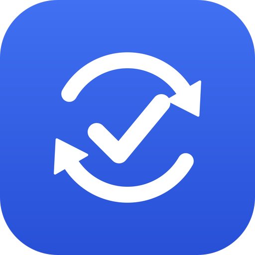
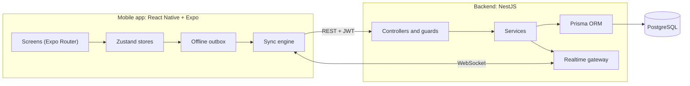
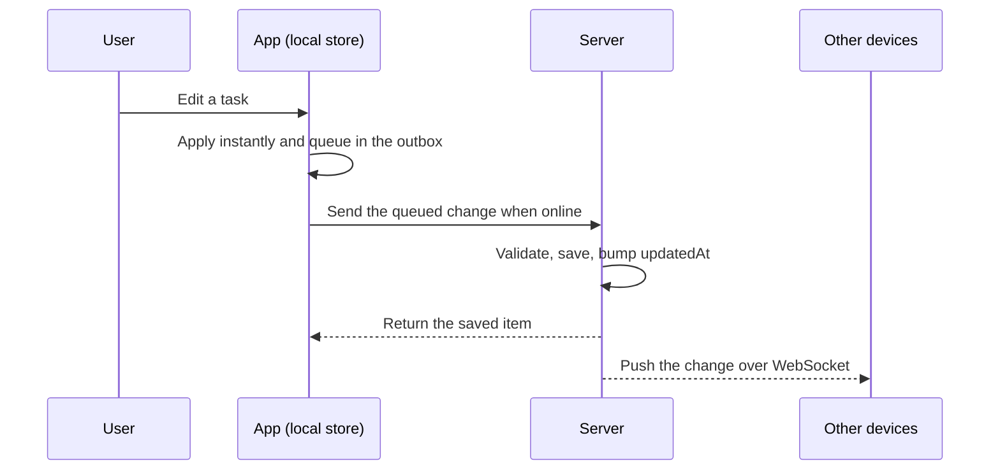

<div align="center">



# SyncNotes

**Tasks and notes that stay in sync on every device, online or offline.**

A full-stack, offline-first app with real-time sync, due dates, local reminders, and a fully bilingual (English / Persian, RTL) interface.

<p>
  
  
  
  
  
  
  
  
</p>

[Features](#features) ·
[Architecture](#architecture) ·
[Getting started](#getting-started) ·
[Design decisions](#design-decisions) ·
[Roadmap](#roadmap)

</div>

---

## About

SyncNotes is a task and note app I built end to end: a NestJS API with PostgreSQL and a React Native app for iOS and Android. Changes made on one device show up on the others within moments, and the app keeps working without a connection. Anything you do offline is queued and sent when the network returns.

I built it to show how I approach a real product problem across the whole stack: data modelling, authentication, real-time communication, offline behaviour, internationalisation, and shipping an installable build.

## Features

| Area | What it does |
| --- | --- |
| **Tasks and notes** | Create, edit, and delete tasks and notes with tags, full-text search, and filters. |
| **Due dates and reminders** | Set a due date on a task and pick a reminder (on time, 1 hour before, or 1 day before). Reminders are local notifications, so they work offline. Overdue tasks are highlighted in the list. |
| **Real-time sync** | Changes are pushed to your other devices over WebSocket (Socket.IO), scoped to your account. |
| **Offline-first** | Edits apply instantly on the device and are queued in an outbox. The queue is sent in order when you are back online. |
| **Authentication** | Email and password sign-up and sign-in, short-lived access tokens, rotating refresh tokens, and secure on-device token storage. |
| **Bilingual UI** | English and Persian with i18next. Persian uses a right-to-left layout. The app starts in the device language. |
| **Themes** | Light, dark, or follow the system. |
| **Sync status** | A small status pill always shows whether you are live, offline, syncing, or have changes waiting to sync. |
| **Accessibility** | Labelled controls, large touch targets, and screen-reader announcements for status changes. |

<!--
Screenshots: add your images to docs/screenshots/ and remove the comment markers.

<p align="center">
  
  
  
  
</p>
-->

<!--
Live demo: once you publish the APK (GitHub Releases), uncomment and set the link.

**Try it on Android:** [Download the latest APK](https://github.com/YOUR-USERNAME/syncnotes/releases/latest)
-->

## Architecture



### How a change travels



## Tech stack

| Layer | Technology |
| --- | --- |
| Mobile | React Native, Expo (SDK 57), Expo Router, TypeScript |
| State | Zustand with persisted stores |
| Internationalisation | i18next, react-i18next, expo-localization |
| Mobile storage | expo-secure-store (tokens), AsyncStorage (items and outbox) |
| Notifications | expo-notifications (local), @react-native-community/datetimepicker |
| Backend | NestJS 11, TypeScript |
| Database | PostgreSQL, Prisma |
| Real time | Socket.IO |
| Security | JWT, bcrypt, helmet, rate limiting, request validation |

## Repository structure

```text
syncnotes/
├── backend/    NestJS API, Prisma schema, WebSocket gateway
├── mobile/     React Native app (Expo)
└── docs/       Images used in the READMEs
```

Each part has its own README with more detail:

- [`backend/README.md`](backend/README.md): API reference, data model, security, deployment
- [`mobile/README.md`](mobile/README.md): app architecture, offline sync, notifications, building an installable app

## Getting started

### Prerequisites

- Node.js 20 or newer
- Docker (for a local PostgreSQL), or any other PostgreSQL instance
- A phone with [Expo Go](https://expo.dev/go), or an Android/iOS emulator

### 1. Start the backend

```bash
cd backend
cp .env.example .env        # then set the two JWT secrets
docker compose up -d        # PostgreSQL
npm install
npm run prisma:migrate      # create the tables
npm run start:dev           # http://localhost:3000/api
```

### 2. Start the mobile app

```bash
cd mobile
cp .env.example .env        # set EXPO_PUBLIC_API_URL
npm install
npx expo start
```

Set `EXPO_PUBLIC_API_URL` to an address your phone can reach, for example `http://192.168.1.20:3000` on the same Wi-Fi, or `http://10.0.2.2:3000` from the Android emulator. Do not add `/api`.

> Reminders use native notifications, which Expo Go does not support on Android. Everything else works in Expo Go. To test reminders on Android, build a development build or the APK (see the [mobile README](mobile/README.md#build-an-installable-android-app)).

## Design decisions

- **Offline-first with an outbox.** Every change is applied locally first and recorded as an operation in a persisted queue. Edits to the same item are merged, and a create followed by a delete cancels out before it ever reaches the server. A revision counter protects edits that happen while a request is in flight.
- **Client-generated UUIDs.** The app creates item IDs itself, so a create can be retried safely. A duplicate returns `409` and the client treats it as already saved.
- **Soft deletes plus `updatedSince`.** Deleted items keep a `deletedAt` timestamp, so a device that was offline can ask for everything that changed since its last sync, including deletions.
- **Refresh token rotation.** Each refresh issues a new pair. Only a SHA-256 hash of the refresh token is stored, and reusing an old token revokes the session. I used SHA-256 rather than bcrypt here because bcrypt only reads the first 72 bytes, and the start of every JWT looks the same.
- **Local reminders.** Notifications are scheduled on the device from synced data, so they work offline and need no push service. The schedule is rebuilt whenever tasks or the language change. iOS keeps at most 64 pending notifications, so the nearest 60 are scheduled.
- **Last write wins.** If a device has an unsent local change for an item, that local version takes priority over an incoming server version. It is simple and predictable for a single-user app.

## Roadmap

- [x] Authentication with refresh token rotation
- [x] Real-time sync over WebSocket
- [x] Offline-first outbox
- [x] Due dates and local reminders
- [x] English and Persian with RTL
- [ ] Automated tests (unit and end to end)
- [ ] Server push notifications (FCM and APNs) so reminders reach every device
- [ ] Persian (Jalali) calendar picker
- [ ] Docker image and CI pipeline for the backend
- [ ] Web client sharing the same API

## Author

Built by **Mobin**, a full-stack developer working with Next.js, NestJS, React Native, and PostgreSQL.
