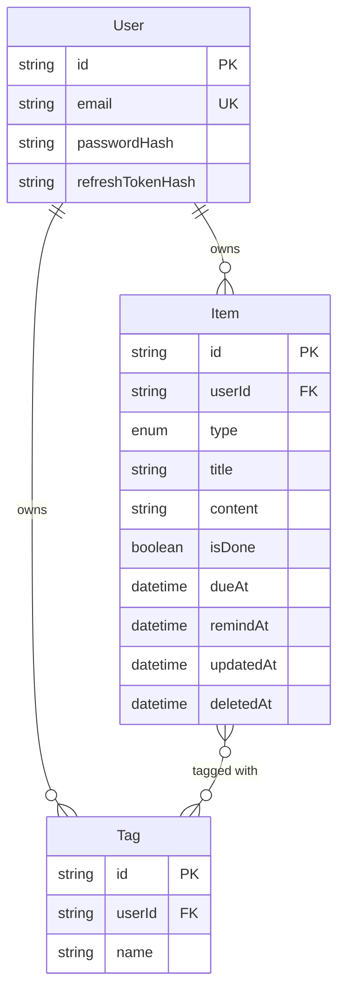

# SyncNotes Backend

The API behind SyncNotes: authentication, tasks and notes, and real-time sync between devices.


## Overview

A NestJS 11 service written in TypeScript. It stores data in PostgreSQL through Prisma, exposes a REST API under `/api`, and pushes changes to a user's other devices over Socket.IO. The design goal was an API that an offline-first mobile client can sync against safely: idempotent creates, soft deletes, and a "changes since" query.

## Features

- Email and password authentication with JWT access tokens and rotating refresh tokens
- CRUD for tasks and notes with tags, due dates, and reminder times
- Search, filtering, and cursor-based pagination
- Sync endpoint: fetch everything changed since a timestamp, including deletions
- Real-time events over WebSocket, delivered only to the owner's devices
- Input validation, rate limiting, security headers, and environment validation at startup

## Getting started

### Prerequisites

- Node.js 20 or newer
- Docker (optional, for the bundled PostgreSQL), or your own PostgreSQL instance

### Run locally

```bash
cp .env.example .env          # set the JWT secrets
docker compose up -d          # PostgreSQL on localhost:5432
npm install
npm run prisma:migrate        # create or update the tables
npm run start:dev             # http://localhost:3000/api
```

### Environment variables

| Variable | Required | Description |
| --- | --- | --- |
| `DATABASE_URL` | Yes | PostgreSQL connection string. |
| `JWT_ACCESS_SECRET` | Yes | Secret for access tokens. At least 32 characters. |
| `JWT_REFRESH_SECRET` | Yes | Secret for refresh tokens. At least 32 characters and different from the access secret. |
| `JWT_ACCESS_TTL` | No | Access token lifetime. Default `15m`. |
| `JWT_REFRESH_TTL` | No | Refresh token lifetime. Default `7d`. |
| `PORT` | No | HTTP port. Default `3000`. |
| `CORS_ORIGINS` | No | Comma-separated browser origins. The mobile app does not need it. |

The app refuses to start if a required value is missing, a secret is too short, or the two secrets are identical.

Generate a secret with:

```bash
openssl rand -base64 48
```

### Scripts

| Script | Purpose |
| --- | --- |
| `npm run start:dev` | Start in watch mode |
| `npm run build` | Compile to `dist/` |
| `npm run start:prod` | Run the compiled app |
| `npm run typecheck` | Type-check without emitting |
| `npm run prisma:migrate` | Create and apply a migration (development) |
| `npm run prisma:deploy` | Apply existing migrations (production) |
| `npm run prisma:generate` | Regenerate the Prisma client |

## API reference

Base URL: `http://localhost:3000/api`. Protected routes need `Authorization: Bearer <accessToken>`.

### Auth

| Method | Path | Description |
| --- | --- | --- |
| `POST` | `/auth/register` | Create an account and return tokens |
| `POST` | `/auth/login` | Sign in and return tokens |
| `POST` | `/auth/refresh` | Exchange a refresh token for a new token pair |
| `POST` | `/auth/logout` | Revoke the current refresh token |
| `GET` | `/auth/me` | Return the signed-in user |

Passwords must be 8 to 72 characters and include a letter and a number. Register and login are limited to 5 requests per minute per IP.

### Items

| Method | Path | Description |
| --- | --- | --- |
| `POST` | `/items` | Create a task or note. The `id` is optional, so offline clients can supply their own UUID. |
| `GET` | `/items` | List items with filters and pagination |
| `GET` | `/items/:id` | Get one item |
| `PATCH` | `/items/:id` | Update an item. Send `null` for `dueAt` or `remindAt` to clear them. |
| `DELETE` | `/items/:id` | Soft delete an item (returns `204`) |

**Query parameters for `GET /items`**

| Parameter | Description |
| --- | --- |
| `type` | `TASK` or `NOTE` |
| `isDone` | `true` or `false` |
| `tag` | Items with this tag |
| `search` | Case-insensitive match on title and content |
| `updatedSince` | ISO date. Switches to **sync mode**: returns every change after that time, including deleted items, oldest first. |
| `limit` | Page size, 1 to 200 (default 50) |
| `cursor` | The `nextCursor` value from the previous page |

**Item fields**

| Field | Rules |
| --- | --- |
| `type` | `TASK` or `NOTE`. Cannot be changed after creation. |
| `title` | Required, up to 200 characters |
| `content` | Optional, up to 20,000 characters |
| `isDone` | Optional boolean |
| `tags` | Up to 10 tags, each up to 40 characters. Stored lowercase and unique per user. |
| `dueAt` | Optional ISO date-time |
| `remindAt` | Optional ISO date-time |

### Examples

Create an item:

```bash
curl -X POST http://localhost:3000/api/items \
  -H "Authorization: Bearer $TOKEN" \
  -H "Content-Type: application/json" \
  -d '{
    "type": "TASK",
    "title": "Send the invoice",
    "tags": ["work"],
    "dueAt": "2026-10-20T09:00:00.000Z",
    "remindAt": "2026-10-20T08:00:00.000Z"
  }'
```

Fetch changes since the last sync:

```bash
curl "http://localhost:3000/api/items?updatedSince=2026-10-19T00:00:00.000Z" \
  -H "Authorization: Bearer $TOKEN"
```

## Real-time events

Connect to the `/realtime` namespace at the server root (not under `/api`) and pass the access token:

```ts
import { io } from 'socket.io-client';

const socket = io('http://localhost:3000/realtime', {
  auth: { token: accessToken },
});

socket.on('item:created', (item) => { /* ... */ });
socket.on('item:updated', (item) => { /* ... */ });
socket.on('item:deleted', ({ id, deletedAt }) => { /* ... */ });
```

The server verifies the token on connect and places the socket in a private room for that user. Invalid connections are dropped. Events are only sent to the owner's room, so users never see each other's data.

## Data model



The schema lives in [`prisma/schema.prisma`](prisma/schema.prisma). Items are indexed on `(userId, updatedAt)` to keep list and sync queries fast. Tag names are unique per user.

## Security

- Passwords are hashed with bcrypt (12 rounds). Login runs a dummy comparison for unknown emails so response time does not reveal which emails exist.
- Access tokens are short-lived. Refresh tokens rotate on every use, only their SHA-256 hash is stored, and reusing an old refresh token revokes the session.
- Every query is scoped by `userId`. Requesting another user's item returns `404`, not `403`, so IDs are not leaked.
- All input goes through `class-validator` with `whitelist` and `forbidNonWhitelisted`, so unknown fields are rejected.
- Global rate limit of 100 requests per minute per IP, with a stricter limit on register and login.
- `helmet` security headers, and CORS limited to the origins you configure.
- Configuration is validated at startup, including secret length.

## Deployment

The service runs anywhere that provides Node.js and PostgreSQL. Example settings for a Node web service (such as Render):

| Setting | Value |
| --- | --- |
| Root directory | `backend` |
| Build command | `npm install --include=dev && npx prisma generate && npm run build` |
| Start command | `npx prisma migrate deploy && npm run start:prod` |

Set `DATABASE_URL`, `JWT_ACCESS_SECRET`, `JWT_REFRESH_SECRET`, and optionally the TTL variables. The hosting platform normally provides `PORT`.

Notes:

- Commit the `prisma/migrations` folder. `prisma migrate deploy` applies it on every start.
- The app sets `trust proxy` so rate limiting sees the real client IP behind a reverse proxy.
- Serve the API over HTTPS. Mobile apps block plain HTTP in release builds.
- Free hosting tiers can sleep when idle, so the first request after a pause may be slow.
- Quick check after deploying: `GET /api/auth/me` should return `401`.

## Project structure

```text
backend/
├── prisma/
│   └── schema.prisma          Data model
├── src/
│   ├── auth/                  Register, login, refresh, guards, token service
│   ├── items/                 Tasks and notes: controller, service, DTOs
│   ├── realtime/              Socket.IO gateway and event names
│   ├── prisma/                Prisma client module
│   ├── config/                Environment validation
│   ├── common/                Shared helpers (CORS)
│   ├── app.module.ts
│   └── main.ts                Bootstrap, security middleware, validation
├── docker-compose.yml         Local PostgreSQL
└── .env.example
```

## Limitations

- Conflict handling is last write wins. It fits a single-user app, but it is not a merge strategy for collaborative editing.
- There are no automated tests yet. They are the next thing on the roadmap.
