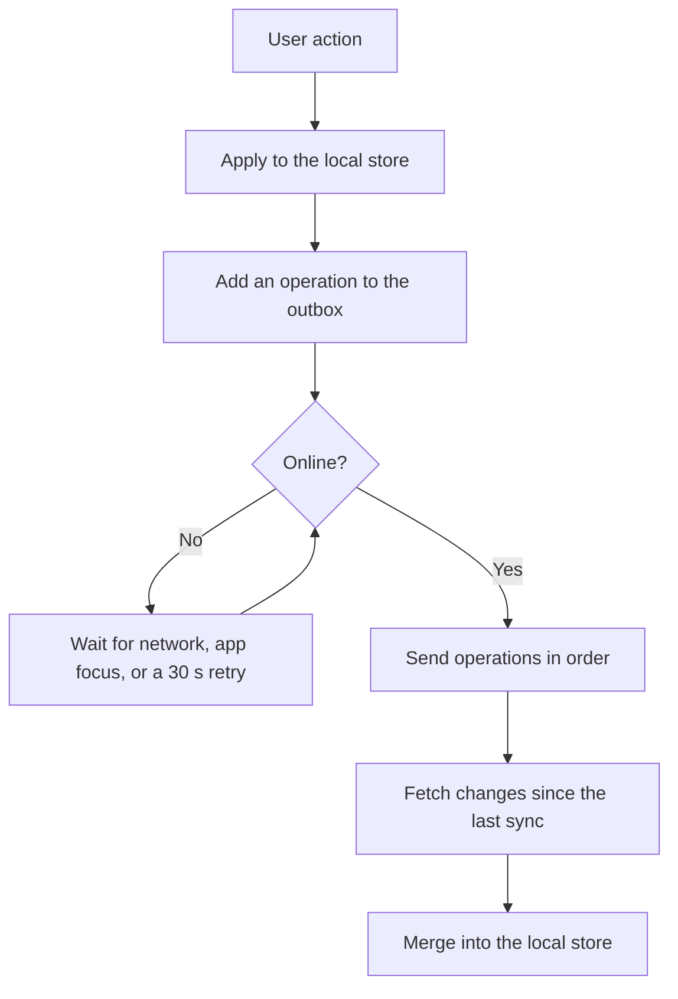

# SyncNotes Mobile

The React Native app for SyncNotes. It keeps tasks and notes in sync across devices, keeps working offline, and reminds you when a task is due.


## Overview

Built with Expo and TypeScript, using Expo Router for navigation and Zustand for state. The app is **local first**: every change is applied on the device immediately and synced in the background, so the interface never waits on the network.

## Features

- Sign up and sign in, with the session stored in the device keychain (`expo-secure-store`)
- Tasks and notes with tags, search, and filters, all running on local data so they are instant and work offline
- Due dates and reminders for tasks (on time, 1 hour before, 1 day before), with overdue tasks highlighted
- Real-time sync with your other devices over WebSocket
- Offline queue that sends your changes in order when the network returns
- English and Persian with i18next, including a right-to-left layout. The first launch follows the device language
- Light, dark, and system themes
- A sync status pill: live, connecting, offline, syncing, or `N` changes waiting
- Tapping a reminder opens that task

## Screens

| Screen | Purpose |
| --- | --- |
| Sign in / Create account | Authentication with inline validation and translated error messages |
| Items | Search, type filter, tag filter, pull to refresh, long press to delete, floating add button |
| Editor | Create or edit a task or note, with tags, due date, and reminder |
| Settings | Language, theme, account, and sign out (with a warning if changes have not synced yet) |

## Tech stack

| Concern | Choice |
| --- | --- |
| Framework | React Native with Expo (SDK 57), TypeScript |
| Navigation | Expo Router (file-based, with protected routes) |
| State | Zustand, persisted with AsyncStorage |
| Real time | socket.io-client |
| Internationalisation | i18next, react-i18next, expo-localization |
| Secure storage | expo-secure-store |
| Connectivity | @react-native-community/netinfo |
| Reminders | expo-notifications (local), @react-native-community/datetimepicker |
| IDs | expo-crypto (UUID v4) |

## Getting started

### Prerequisites

- Node.js 20 or newer
- The SyncNotes backend running (see [`../backend`](../backend))
- [Expo Go](https://expo.dev/go) on a phone, or an emulator

### Run

```bash
cp .env.example .env     # set EXPO_PUBLIC_API_URL
npm install
npx expo start
```

Scan the QR code with Expo Go. Use `npx expo start -c` after changing `app.json` or `.env` to clear the cache.

### Choosing the API address

`EXPO_PUBLIC_API_URL` is the server address **without** `/api`.

| Where the app runs | Value |
| --- | --- |
| Android emulator | `http://10.0.2.2:3000` |
| iOS simulator | `http://localhost:3000` |
| Real phone on the same Wi-Fi | `http://<your-computer-ip>:3000` |
| Production build | `https://your-server.example.com` |

Production builds need HTTPS, because mobile operating systems block plain HTTP by default.

### Scripts

| Script | Purpose |
| --- | --- |
| `npm start` | Start the Expo dev server |
| `npm run android` | Start and open on Android |
| `npm run ios` | Start and open on iOS |
| `npm run typecheck` | Type-check the project |

## Reminders

Reminders are **local notifications**. They are scheduled on the device from the synced tasks, so they work without a connection and need no push service.

- A task can have a due date, and a reminder at the due time, 1 hour before, or 1 day before.
- The schedule is rebuilt when tasks change, when the language changes, and after sign in. Completed tasks are skipped, and signing out cancels everything.
- The permission prompt appears the first time you choose a reminder. If it was denied, the app offers to open the system settings.
- iOS keeps at most 64 pending notifications, so the nearest 60 are scheduled and the rest are added as time passes and tasks change.
- Android may delay notifications by a few minutes when battery saver is active.

**Expo Go on Android does not support `expo-notifications`.** The app detects this and loads the module only where it is available, so everything else still works in Expo Go and choosing a reminder shows an explanation. To try reminders on Android, use a development build or the installable APK below.

## Offline-first sync



How it behaves:

- **Outbox.** Creates, edits, and deletes are stored as operations and persisted, so they survive an app restart.
- **Coalescing.** Several edits to one item become one operation. A create followed by a delete cancels out and never reaches the server.
- **In-flight safety.** Each operation has a revision. If you edit an item while its request is running, the newer version is kept and sent next.
- **Idempotent creates.** The app generates the item UUID. If a create is retried, the server's `409` is treated as success.
- **Pulling changes.** After sending, the app requests everything changed since the last sync (`updatedSince`), including deletions.
- **Real time.** WebSocket events update the local store instantly. If the server closes the socket because the token expired, the app refreshes the token and reconnects.
- **Conflicts.** An item with a pending local change keeps the local version. Otherwise the server version wins.
- **Failures.** Network errors and server errors stop the queue and retry later. Permanent client errors (such as validation failures) drop that operation so one bad request cannot block the rest.
- **Triggers.** Sync runs when connectivity returns, when the app comes to the foreground, when the outbox changes, and on a 30-second retry timer.

## Languages and text direction

All text lives in `src/i18n/en.ts` and `src/i18n/fa.ts`. The Persian file is typed against the English one, so a missing key is a compile error.

- If the user has not chosen a language, the app uses the device language: Persian if it is Persian, otherwise English.
- Switching the language in Settings updates the text immediately.
- React Native only reads the layout direction when the app starts. After switching to or from Persian, the app offers to restart. On the very first launch on a Persian device, the app restarts itself once, guarded so it cannot loop.
- Dates and times are formatted for the active language (the `fa-IR` locale for Persian).

## Build an installable Android app

An APK lets anyone install the app from a link. It needs a public HTTPS backend first.

1. Add `eas.json`:

   ```json
   {
     "build": {
       "preview": {
         "distribution": "internal",
         "android": { "buildType": "apk" },
         "env": { "EXPO_PUBLIC_API_URL": "https://your-server.example.com" }
       }
     }
   }
   ```

   The `.env` file is not uploaded to cloud builds, which is why the address is set here.

2. Build:

   ```bash
   npm install -g eas-cli
   eas login
   eas init
   eas build -p android --profile preview
   ```

3. Open the link from the build page on an Android phone, download the APK, and allow installation from that source.

For a permanent link, download the APK and attach it to a GitHub release.

**iOS:** the same code runs on iPhone. Installing on a device outside Expo Go requires an Apple Developer Program membership (ad hoc build or TestFlight).

## Project structure

```text
mobile/
├── app/
│   ├── _layout.tsx             Root layout, protected routes, notification taps
│   ├── (auth)/                 Sign in and create account
│   └── (app)/                  Items list, editor, settings
├── assets/                     App, adaptive, monochrome, and notification icons
├── src/
│   ├── components/             SyncPill, ItemRow, DateTimeField, forms, buttons
│   ├── config/                 Environment configuration
│   ├── domain/                 Shared types
│   ├── hooks/                  useDebounced, useNotificationTap
│   ├── i18n/                   Translations and text direction
│   ├── services/
│   │   ├── api/                HTTP client with token refresh, endpoints
│   │   ├── notifications/      Reminder scheduling, safe notifications loader
│   │   ├── realtime/           Socket.IO client
│   │   ├── storage/            Secure session storage
│   │   └── sync/               Sync engine
│   ├── stores/                 Auth, items and outbox, settings, sync status
│   ├── theme/                  Colors, spacing, typography
│   ├── utils/                  Validation, formatting, errors, reminder math
│   └── bootstrap.ts            Startup order: settings, language, data, session
├── app.json
├── eas.json                    Build profiles (added when you build)
└── .env.example
```

## Troubleshooting

| Problem | Fix |
| --- | --- |
| Cannot sign in on a real phone | `EXPO_PUBLIC_API_URL` must be your computer's LAN IP, not `localhost`. Restart with `npx expo start -c`. |
| Error mentioning `expo-notifications` in Expo Go on Android | Expected. Use a development build or the APK to test reminders. |
| Layout is not right-to-left after switching to Persian | Restart the app. The direction is applied at startup. |
| Changes not syncing | Check the status pill. If it shows a waiting count, pull down on the list to force a sync. |
| Web build fails | The app targets iOS and Android only. |

## Limitations

- Reminders are local, so a device only gets a reminder after the task has synced to it. Server push notifications are on the roadmap.
- Dates use the system date picker. A dedicated Persian calendar picker is planned.
- There are no automated tests yet.
